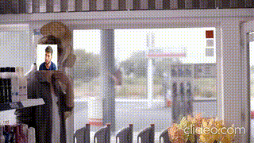

# Face Replacement Video Demo

This repository contains a Python script (`main.py`) that allows you to replace faces in a video with custom images and overlay logos. The project was created as a **demonstration of my skills** to accompany my resume when applying to companies.  

---

## Purpose

The main idea of this project is to:

- Replace faces in a video with **my own face** or another chosen image.
- Replace specific objects (like the Axe deodorant in the demo video) with a **company logo or related image**.
- Showcase my **Python, OpenCV, and computer vision skills** in a visually engaging way.
- Demonstrate practical experience with face detection using **MTCNN** and template matching.

This project is meant to highlight my technical skills in a creative manner that is **personalized for each company** I apply to.

---

## Features

- Detects up to **two faces** in each frame and replaces them with custom images.
- Detects and replaces specific objects in the video (e.g., the Axe deodorant) using **template matching**.
- Can skip frames for faster processing while reusing previous detections to maintain performance.
- Automatically preserves **the original audio** of the video.

---

## Requirements

- Python 3.8+
- OpenCV (`cv2`)
- NumPy (`numpy`)
- MTCNN (`pip install mtcnn`)
- ffmpeg (for merging audio back to the processed video)

---

## Usage

1. Replace the `video_path` in `main.py` with the input video.
2. Replace `face1_img`, `face2_img`, and `axe_replace_img` with your own images or company logos.
3. Run the script:

```bash
python main.py
'''
## Example Video

Here’s a short demo of the face replacement in action:




